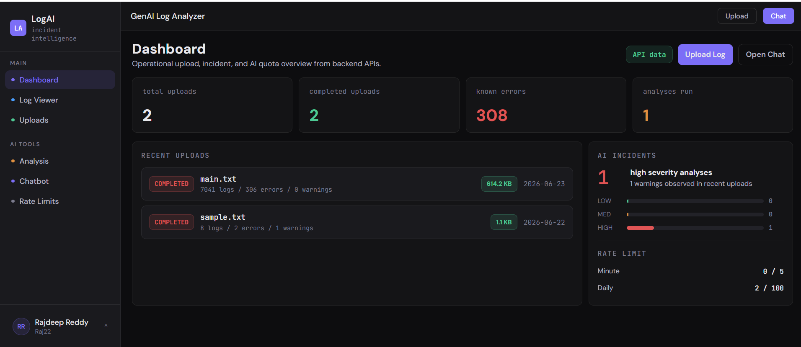
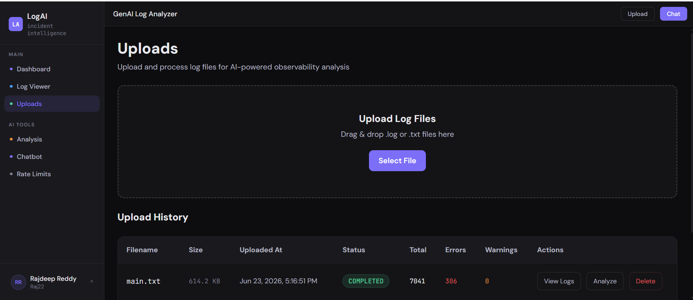
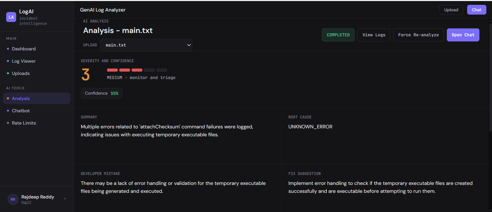
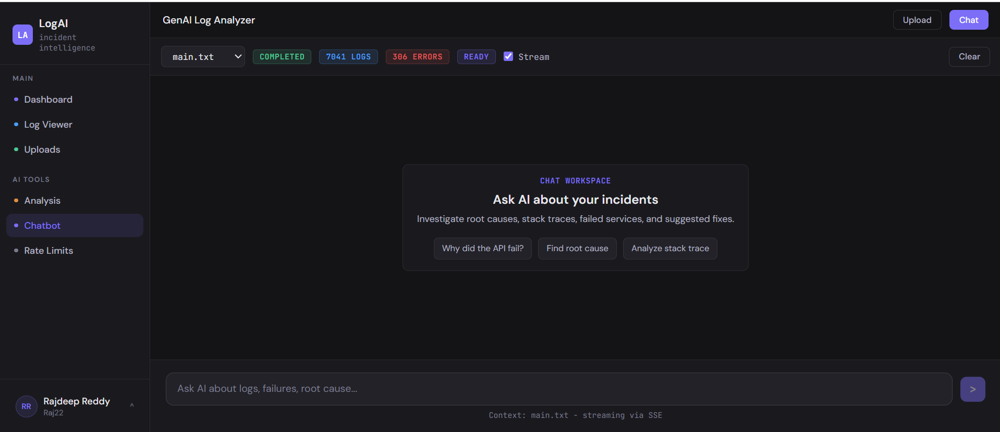
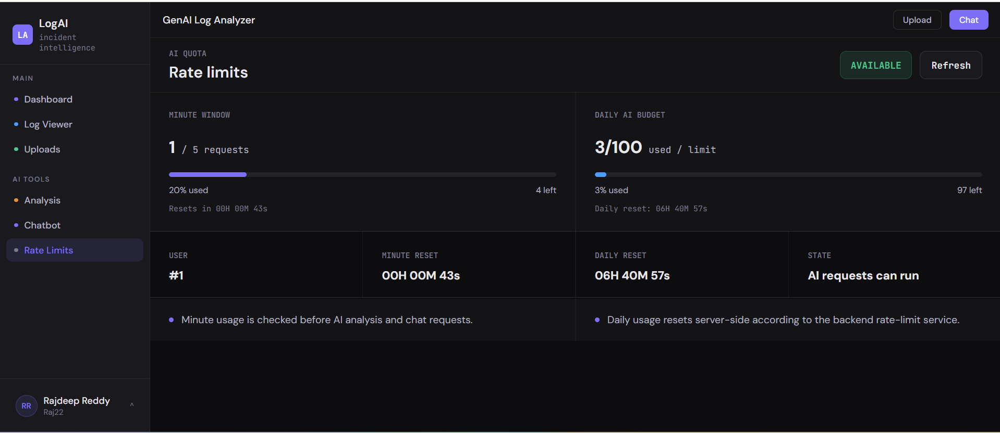

# LogAI - Incident Intelligence Frontend


> Production-grade Angular frontend for an AI-powered incident investigation platform that combines log uploads, searchable log exploration, AI root cause analysis, and real-time conversational troubleshooting.

- **Live Demo:** http://35.154.51.190
- **Backend Repo:** [https://github.com/prajdeepreddy22/log-analyzer](https://github.com/prajdeepreddy22/log-analyzer)
- **Backend Swagger UI:** http://35.154.51.190/api/swagger-ui/index.html
- **Author:** Rajdeep Reddy - [GitHub](https://github.com/prajdeepreddy22)

---

## What Is LogAI Frontend?

LogAI frontend is the Angular 18 client for a full-stack AI log analyzer. It gives developers and support engineers a clean interface to upload log files, inspect parsed events, trigger AI analysis, and continue investigation through a streaming AI chat assistant.

---

## Highlights

- Angular 18 standalone component architecture
- TypeScript strict-mode application
- JWT authentication and protected routing
- Upload workflow for `.log` and `.txt` files
- Searchable log viewer with filters and pagination
- AI analysis page with root cause, severity, confidence score, and fix suggestions
- Real-time chat powered by Server-Sent Events
- Rate-limit dashboard with minute and daily usage timers
- Responsive shell layout with sidebar navigation
- Production build configured for `/api` reverse proxy routing

Key capabilities:

- Authenticated user flows for registration, login, profile, and logout
- Upload history with file size, parsed count, warning count, and error count
- Structured log browsing by level, service, timestamp, and keyword
- AI-assisted incident investigation from uploaded log context
- SSE streaming chat with safe stop/cleanup behavior
- User-friendly API error handling and toast notifications

---

## Tech Stack

| Layer | Technology |
| --- | --- |
| Framework | Angular 18 |
| Language | TypeScript 5.5 |
| Styling | SCSS |
| State | Angular Signals + RxJS |
| Routing | Angular Router with guards |
| HTTP | Angular HttpClient + interceptors |
| Streaming | EventSource / Server-Sent Events |
| Charts | ECharts / ngx-echarts |
| Icons | lucide-angular |
| Markdown | marked + DOMPurify |
| Notifications | ngx-toastr |
| Testing | Jasmine + Karma + ChromeHeadless |
| Build | Angular CLI |
| Deployment | Nginx on AWS EC2, production API base `/api` |

---

## Architecture

```text
Browser
  |
  v
Angular SPA
  |
  |-- Auth Guard + JWT Interceptor
  |-- Upload / Logs / Analysis / Chat Stores
  |-- EventSource SSE Client
  |
  v
/api/* reverse proxy
  |
  v
Spring Boot Backend
  |
  +-- MySQL
  +-- OpenAI GPT-4o mini
```

The production frontend uses a relative API base URL (`/api`), allowing Nginx or CloudFront to route frontend pages and backend API requests from the same domain.

---

## Features

### Authentication

- Register and login flows
- JWT stored through a dedicated token utility
- Auth interceptor attaches `Authorization: Bearer <token>` to API requests
- Route guards protect dashboard, uploads, logs, analysis, chat, and rate-limit pages
- Profile menu supports profile updates and logout

### Uploads

- Drag-and-drop style upload workflow
- Upload history table with status, size, parsed logs, warnings, and errors
- Custom delete confirmation modal matching the app UI
- Polling-based upload status refresh

### Log Viewer

- Parsed log table with level, timestamp, service, and message
- Search and filtering by keyword, level, service, and date range
- Stats cards for log totals and severity breakdown
- Inline AI panel for analysis context

### AI Analysis

- Trigger analysis per upload
- Polling lifecycle for queued, processing, completed, failed, and not-started states
- Displays summary, root cause, developer mistake, fix suggestion, code fix, severity, and confidence score
- History view for previous analyses

### AI Chat

- Streaming AI assistant with EventSource
- Chunk-by-chunk response rendering
- Stop streaming support
- Referenced log cards and insight chips
- Safe rendering for markdown content through sanitization

### Rate Limits

- Minute and daily AI budget display
- Human-readable countdown timers
- Blocked state handling
- Refreshes usage after analysis and chat activity

---

## Project Metrics

- Angular 18 standalone UI
- 100+ frontend unit tests
- Strict TypeScript application and spec type checks
- JWT-secured API integration
- Real-time SSE chat integration
- Production build output for static hosting
- Environment-based API configuration
- Responsive dashboard-style user experience

---

## Request Flow

1. User logs in and receives a JWT
2. Frontend stores the token and attaches it to protected API calls
3. User uploads a `.log` or `.txt` file
4. Backend parses logs and returns upload status
5. User opens logs, searches, filters, and inspects entries
6. User triggers AI analysis for an upload
7. Frontend polls analysis status until completion
8. User asks follow-up questions in AI chat
9. EventSource streams the assistant response in real time
10. Rate-limit counters update after AI usage

---

## Main Routes

| Route | Description |
| --- | --- |
| `/login` | User login |
| `/register` | User registration |
| `/dashboard` | Main dashboard |
| `/uploads` | Upload and upload history |
| `/logs` | Logs landing page |
| `/logs/:uploadId` | Parsed log viewer |
| `/analysis` | Analysis landing/redirect |
| `/analysis/:uploadId` | AI analysis result page |
| `/chat` | AI chat assistant |
| `/rate-limit` | AI usage and quota dashboard |

---

## API Integration

Production API base URL:

```ts
apiBaseUrl: '/api'
```

Development API base URL:

```ts
apiBaseUrl: 'http://127.0.0.1:8080/api'
```

Important backend contracts:

| Frontend Use Case | Backend Endpoint |
| --- | --- |
| Register | `POST /api/auth/register` |
| Login | `POST /api/auth/login` |
| Current profile | `GET /api/auth/me` |
| Update profile | `PATCH /api/auth/profile` |
| Upload file | `POST /api/upload` |
| Upload history | `GET /api/uploads` |
| Logs | `GET /api/logs/{uploadId}` |
| Log search | `POST /api/logs/search/{uploadId}` |
| Analysis trigger | `POST /api/analysis/{uploadId}` |
| Analysis status | `GET /api/analysis/{uploadId}/status` |
| Analysis result | `GET /api/analysis/{uploadId}` |
| Chat | `POST /api/chat` |
| Streaming chat | `GET /api/chat/stream?message=...&uploadId=...&token=...` |
| Rate limits | `GET /api/rate-limit/status` |

---

## Running Locally

### Prerequisites

- Node.js 20+
- npm
- Angular CLI or `npx ng`
- Running LogAI backend on `http://127.0.0.1:8080/api`

Install dependencies:

```bash
npm ci
```

Start development server:

```bash
npm start
```

Open:

```text
http://localhost:4200
```

---

## Verification

Run strict application type check:

```bash
npm run typecheck
```

Run strict spec type check:

```bash
npm run typecheck:spec
```

Run CI unit tests:

```bash
npm run test:ci
```

Build production bundle:

```bash
npm run build:prod
```

Expected production output:

```text
dist/log-analyzer-ui/browser
```

---

## Deployment

Current portfolio deployment:

```text
AWS EC2 t3.micro (Amazon Linux 2023, ap-south-1)
|-- Nginx serves Angular static files
|-- Nginx proxies /api/* to Spring Boot backend
|-- Spring Boot backend runs in Docker
`-- MySQL runs in Docker
```

Production deployment requirements:

- Build with `npm run build:prod`
- Serve files from `dist/log-analyzer-ui/browser`
- Configure SPA fallback to `index.html`
- Proxy `/api/*` to the backend without adding another `/api` prefix
- Forward `Authorization` header for authenticated API calls
- Forward query parameters for SSE chat
- Keep backend CORS aligned with the deployed frontend origin

For S3 + CloudFront deployment, ensure:

- `/api/*` cache behavior points to backend origin
- `/api/*` caching is disabled
- Query strings are forwarded
- `Authorization` and CORS headers are forwarded
- Origin response timeout supports long SSE responses
- Static frontend routes fall back to `index.html`

See [DEPLOYMENT.md](DEPLOYMENT.md) for the full deployment checklist.

---

## Project Structure

```text
src/app/
|-- core/
|   |-- api/           # Backend API clients
|   |-- guards/        # Auth route guards
|   |-- interceptors/  # JWT and API error interceptors
|   |-- models/        # Typed request/response models
|   |-- services/      # Streaming and session services
|   |-- stores/        # Signal/RxJS state services
|   `-- utils/         # Token, file size, error, streaming utilities
|-- features/
|   |-- auth/          # Login and registration
|   |-- dashboard/     # Dashboard home
|   |-- uploads/       # Upload flow and history
|   |-- logs/          # Log viewer and filters
|   |-- analysis/      # AI analysis pages
|   |-- chat/          # AI chat assistant
|   `-- rate-limit/    # Usage dashboard
|-- shared/
|   |-- components/    # Sidebar, topbar, reusable UI pieces
|   |-- layouts/       # Auth layout and app shell
|   `-- pipes/         # Markdown rendering pipe
+-- environments/      # Development and production API config
```

---

## Key Design Decisions

**Relative Production API URL:** Production uses `/api` so the same frontend build works behind Nginx or CloudFront reverse proxy routing.

**EventSource For Chat:** The browser `EventSource` API is used for streaming AI responses. Since it cannot send custom headers, the SSE token is passed as a URL query parameter for that endpoint only.

**Signals + RxJS Stores:** Feature state is organized in small services using Angular Signals and RxJS so pages stay reactive without adding NgRx complexity.

**Strict Typed Models:** API contracts are represented with TypeScript models for auth, uploads, logs, analysis, chat, and rate limits.

**Sanitized Markdown Rendering:** AI responses can contain markdown. The frontend renders markdown through `marked` and sanitizes it with DOMPurify.

**Static Hosting Ready:** The production bundle is static and can be served from Nginx, S3 + CloudFront, or another static host with SPA fallback.

---

## Screenshots

### Dashboard



### Uploads



### AI Analysis



### AI Chat



### Rate Limits



---

## Security Notes

- No secrets are stored in the Angular source code
- Production build uses relative `/api` routing instead of hardcoded backend secrets
- JWT is stored and attached through dedicated frontend utilities/interceptors
- Protected routes require authentication
- API errors are normalized into user-friendly messages
- AI-generated markdown is sanitized before rendering

---

## Future Enhancements

- Dark mode
- More dashboard charts
- Export analysis reports as PDF
- Saved chat sessions
- WebSocket fallback for streaming
- S3 + CloudFront static hosting variant
- End-to-end tests with Playwright or Cypress

---

Built by Rajdeep Reddy as a portfolio project demonstrating Angular 18, TypeScript strict mode, JWT authentication, real-time SSE streaming, AI-powered workflows, and AWS deployment.
