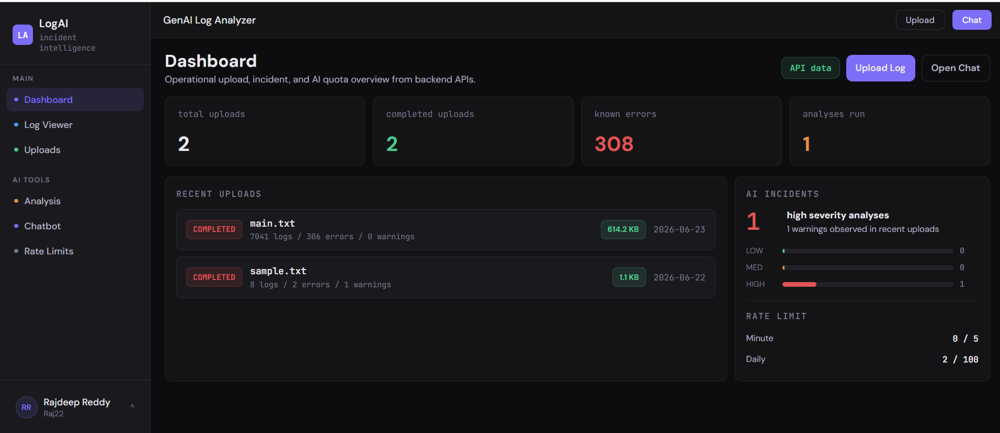
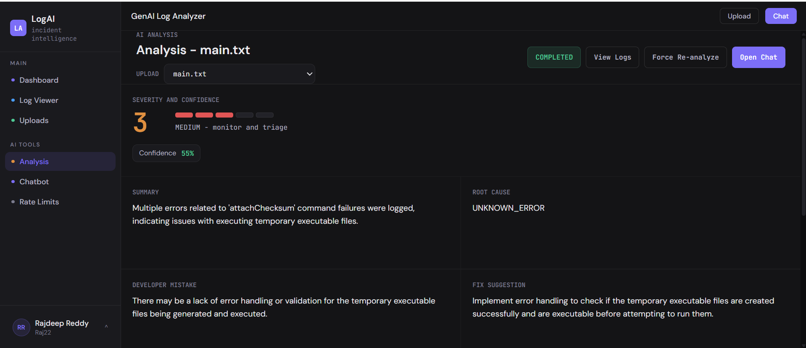

# LogAI - Incident Intelligence Frontend


LogAI is an Angular application I built for investigating application logs with AI. It covers the complete frontend flow: authentication, file uploads, parsed log exploration, AI analysis, streaming chat, and usage tracking.

- **Live application:** http://35.154.51.190
- **Backend repository:** [prajdeepreddy22/log-analyzer](https://github.com/prajdeepreddy22/log-analyzer)
- **Backend Swagger UI:** http://35.154.51.190/api/swagger-ui/index.html

## What I Wanted From The Frontend

The backend produces useful analysis data, but I wanted the investigation workflow to feel like one connected product instead of a collection of API screens. The frontend guides a user from uploading a file to understanding an incident and asking follow-up questions.

This project helped me work through practical Angular concerns such as typed API contracts, authentication state, polling, SSE cleanup, error handling, responsive layouts, and production routing behind Nginx.

## Main Features

### Authentication

- Registration and login with validation feedback
- JWT-based session handling
- Route guards for authenticated pages
- Profile update and logout from the sidebar menu
- Automatic handling for invalid or expired sessions

### Uploads

- Drag-and-drop file upload
- Upload progress and processing status
- History with file size, total logs, warnings, and errors
- Custom confirmation dialog for deletion
- Polling that stops when processing reaches a terminal state

### Log viewer

- Paginated structured log table
- Filters for level, service, keyword, and date range
- Error and warning statistics
- Upload-aware navigation between logs, analysis, and chat

### AI analysis

- Starts analysis for a selected upload
- Polls queued and processing states
- Displays summary, root cause, severity, confidence, developer mistake, and suggested fix
- Preserves failed-state reasons instead of showing a generic empty page

### Streaming chat

- Uses browser `EventSource` for SSE responses
- Renders response chunks as they arrive
- Supports stopping an active stream
- Shows referenced logs and extracted insight chips
- Sanitizes AI-generated Markdown before rendering

### Usage limits

- Displays minute and daily AI usage
- Shows live reset countdowns
- Refreshes counters after analysis and chat requests
- Handles blocked and rate-limited states

## Tech Stack

| Area | Technology |
| --- | --- |
| Framework | Angular 18, standalone components |
| Language | TypeScript 5.5, strict mode |
| Styling | SCSS |
| State | Angular Signals and RxJS |
| HTTP | Angular HttpClient and interceptors |
| Routing | Angular Router and auth guard |
| Streaming | EventSource / Server-Sent Events |
| Charts | ECharts and ngx-echarts |
| Icons | Lucide Angular |
| Markdown | marked and DOMPurify |
| Notifications | ngx-toastr |
| Testing | Jasmine, Karma, ChromeHeadless |
| Deployment | Nginx on AWS EC2 |

## Application Flow

```text
Login
  |
  v
Dashboard --> Upload file --> Processing status
                              |
                              v
                         Parsed log viewer
                              |
                    +---------+---------+
                    |                   |
                    v                   v
               AI analysis        Streaming chat
                    |                   |
                    +---------+---------+
                              |
                              v
                       Rate-limit refresh
```

The production build uses `/api` as a relative backend URL. Nginx serves the Angular files and proxies `/api/*` to Spring Boot, so the browser sees one origin.

## Frontend Structure

```text
src/app/
|-- core/
|   |-- api/           Typed backend API clients
|   |-- guards/        Authentication guard
|   |-- interceptors/  JWT and API error handling
|   |-- models/        Request and response types
|   |-- services/      SSE and session services
|   |-- stores/        Signal/RxJS feature state
|   `-- utils/         Token, error, file-size, and stream helpers
|-- features/
|   |-- auth/
|   |-- dashboard/
|   |-- uploads/
|   |-- logs/
|   |-- analysis/
|   |-- chat/
|   `-- rate-limit/
`-- shared/
    |-- components/    Sidebar, topbar, and reusable controls
    |-- layouts/       Auth layout and application shell
    `-- pipes/         Sanitized Markdown rendering
```

## Routes

| Route | Purpose |
| --- | --- |
| `/login` | Login |
| `/register` | Create an account |
| `/dashboard` | Overview |
| `/uploads` | Upload and history |
| `/logs/:uploadId` | Parsed log viewer |
| `/analysis/:uploadId` | AI analysis result |
| `/chat` | Log-aware AI chat |
| `/rate-limit` | AI usage and reset timers |

## Implementation Notes

### Small feature stores instead of NgRx

I used focused services built with Angular Signals and RxJS. The application needed shared async state, but not enough global complexity to justify adding NgRx.

### Polling has explicit terminal states

Upload and analysis polling stop on completed, failed, not-started, or unavailable states. This prevents repeated requests and endless loading states.

### SSE is isolated in one service

Connection setup, message parsing, error events, completion, and cleanup live in the streaming service. Components receive state updates without managing the raw `EventSource` lifecycle.

### API errors are normalized once

Backend errors can expose `details`, `errorMessage`, `error_message`, or `message`. A shared utility selects the best safe message so each page does not implement its own fallback chain.

### Production uses a relative API URL

Development calls `http://127.0.0.1:8080/api`. Production calls `/api`, which works behind Nginx today and can also work behind CloudFront without rebuilding the Angular bundle.

## Running Locally

### Requirements

- Node.js 20+
- npm
- LogAI backend running on `http://127.0.0.1:8080/api`

```bash
npm ci
npm start
```

Open `http://localhost:4200`.

## Build And Test

```bash
npm run typecheck
npm run typecheck:spec
npm run test:ci
npm run build:prod
```

Production files are generated in:

```text
dist/log-analyzer-ui/browser
```

Production source maps are disabled, filenames are hashed, and Angular CLI enforces bundle and component-style budgets.

## Environment Configuration

Development:

```ts
apiBaseUrl: 'http://127.0.0.1:8080/api'
```

Production:

```ts
apiBaseUrl: '/api'
```

No backend credentials or OpenAI keys belong in the Angular application. The browser only stores the authenticated user's JWT.

## Deployment

The live portfolio version is built with `npm run build:prod` and served by Nginx on the same EC2 instance as the backend.

```text
Browser
  |
  v
Nginx on EC2
  |-- /*      Angular static files
  `-- /api/*  Spring Boot container
```

CloudFront and HTTPS are the next infrastructure step. Because production already uses `/api`, that change does not require a frontend code change. It requires the correct CloudFront behavior, query-string forwarding for SSE, and a matching backend CORS origin.

## What I Would Improve Next

- The live site currently uses HTTP
- The frontend is a client-rendered SPA without server-side rendering
- Automated browser end-to-end tests are not included yet
- Chat history is kept in the active frontend session rather than a dedicated conversation service

For the next iteration, I would add CloudFront/HTTPS first, followed by a small Playwright smoke-test suite covering login, upload, analysis, and chat.

## Screenshots

### Dashboard



### Uploads


### AI Analysis



### AI Chat


### Rate Limits


## What I Learned

I built this frontend to demonstrate Angular development beyond static forms and CRUD screens. The main challenges were coordinating asynchronous backend work, keeping API contracts typed, handling streaming responses safely, and turning a technical log-analysis workflow into a usable interface.

The Spring Boot backend is available at [prajdeepreddy22/log-analyzer](https://github.com/prajdeepreddy22/log-analyzer).
